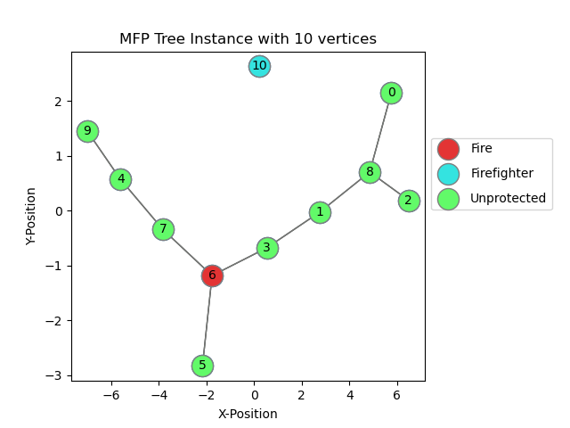

# Moving Firefighter Problem: Tree Instance Generator


This repository offers a tree instance generator tailored for the Moving Firefighter Problem, as detailed in the accompanying publication (Moving Firefighter Problem).
The generator operates by creating random 'networkx' tree objects, utilizing a distinct seed sequence with default entropy for each experiment. Subsequently, it introduces
an external 'agent' node into the tree structure. The original adjacency matrix is then populated with escalated metric distances between all nodes and is called FDM matrix.
Finally, the generator embeds the resulting structure in a 2D plane for visualization.

Parameters such as *root_degree*, *scale*, *agent_position*, and *fire_advance* are configurable within the constants.py file.

usage:

```python
src/mfpgen/instgen.py -l LOAD_MODE -g SIZE_GRID -s #TREES
```

LOAD_MODE:
- T : Load and experiment for reproducibility
- F : Create a new experiment

SIZE_GRID:
  - An Integer sequence separated by commas which represents the tree sizes that we want to generate. Example: 10,15,20

#TREES:
  - How many tree instances we want to generate by tree size in SIZE_GRID.

Example:

```python
src/mfpgen/instgen.py -l F -g 10,15,20 -s 5
```
The aforementioned execution will generate new instances comprising: 5 trees with 10 nodes, 5 trees with 15 nodes, and 5 trees with 20 nodes.

Upon the initial execution of mfpgen, it will establish a directory named Experiments to manage all instances. The structure of this folder is as follows:

```
Experiments
  - - Experiment_0
      - - Size_10
          - - Instance_0
              - - BCKTRCK.mfp
              - - FDM_MFFP.npz
              - - img_10.png
              - - instance_info.json
              - - layout_MFF.json
              - - MFF_Tree.adjlist
              - - SUMMARY.mfo
          .
          .
      - - Size_15
      - - Size_20
  - - Seeds.txt
```

- BCKTRCK.mfp: This file encompasses the entire tree structure and relationships within the graph, serving as input for a backtrack solver.
- FDM_MFFP.npz: A NumPy array storing the FDM matrix and weights for all nodes. These weights signify the number of nodes saved if the corresponding node is protected.
- img_10.png: A PNG image depicting the initial state of the Moving Firefighter Problem Tree (MFPT).
- instance_info.json: This file contains information regarding the tree structure.
- layout_MFF.json: It stores the embedded positions of all nodes in the plane.
- MFF_Tree.adjlist: An adjacency list representing the tree instance.
- SUMMARY.info: Provides general information about the experiment.
- Seeds.txt contains the Seedsequence of the experiment along the initial parameters.

An illustration of a generated instance comprising 10 nodes would appear as follows:



---
